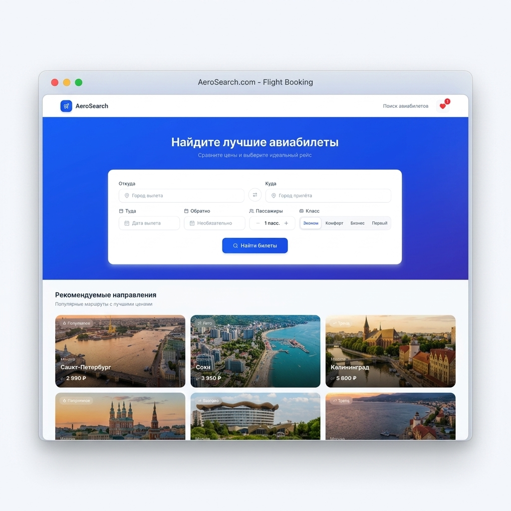

<div align="center">

# ✈️ AeroSearch — Поиск авиабилетов

### Современный сайт поиска авиабилетов, построенный на Next.js 16, FSD-архитектуре, Redux Toolkit и интеграции с Travelpayouts API



[](https://nextjs.org/)
[](https://react.dev/)
[](https://redux-toolkit.js.org/)
[](https://www.typescriptlang.org/)
[](https://tailwindcss.com/)
[](https://www.radix-ui.com/)

</div>

---

## ✨ Возможности

- 🔍 **Поиск рейсов** — выбор городов, дат, количества пассажиров и класса обслуживания.
- 🎯 **Фильтрация** — по цене, авиакомпаниям, количеству пересадок и времени вылета.
- 📊 **Сортировка** — по цене, длительности и оптимальности.
- 🏖️ **Рекомендации** — кликабельные карточки популярных направлений с фотографиями городов.
- 📱 **Адаптивный дизайн** — desktop, tablet и mobile.
- ❤️ **Избранное (Favorites)** — добавление билетов в избранное с сохранением в `localStorage`, счетчик в шапке сайта и выдвижная боковая шторка (Drawer) для быстрого доступа.
- 🖨️ **Печать посадочного талона** — после выбора мест открывается форма успешной покупки с вводом имен пассажиров и генерацией премиальных посадочных талонов (с двойным штрих-кодом, полной информацией о полете). Поддерживается печать через `@media print` на листах A4 (каждый билет на отдельной странице, без лишнего веб-интерфейса).
- 🔌 **Интеграция с Travelpayouts (Aviasales) API** — прокси-маршрут Next.js API с автоматическим резервным копированием (fallback) на встроенную базу данных при отсутствии токена или ошибках сети.
- ⚡ **Встроенная база данных** — 200 разнообразных детализированных авиабилетов для работы "из коробки" без ключей API.
- ✅ **Валидация форм** — React Hook Form + Zod.
- 🚀 **Оптимизация Core Web Vitals** — предзагрузка LCP-изображений (`priority`), оптимизация чанков для Next.js Turbopack.

---

## 🏗️ Архитектура — Feature-Sliced Design (FSD)

```
src/
├── app/                    # App layer — layout, providers, store
│   └── providers/          # Redux store + StoreProvider
├── views/                  # Pages layer (views, чтобы не конфликтовать с Next.js)
│   └── tickets-search/     # Главная страница поиска
├── widgets/                # Widgets — составные блоки UI
│   ├── header/             # Шапка сайта со счетчиком избранного
│   ├── tickets-search-form/# Форма поиска (RHF + Zod)
│   ├── tickets-results/    # Список результатов + рекомендации
│   └── tickets-filters/    # Фильтры (desktop sidebar + mobile drawer)
├── features/               # Features — бизнес-функциональность
│   ├── search-tickets/     # Redux slice + URL params mapper
│   ├── sort-tickets/       # Select сортировки
│   ├── filter-tickets/     # Redux slice фильтров
│   ├── favorites/          # Redux slice избранного, шторка (Drawer)
│   └── boarding-pass/      # Посадочные талоны, печатные формы, модалка покупки
├── entities/               # Entities — бизнес-сущности
│   ├── ticket/             # Типы, API (RTK Query), UI-карточка, моки, словарь авиакомпаний
│   └── airport/            # Типы, список аэропортов
└── shared/                 # Shared — переиспользуемые модули
    ├── api/                # RTK Query baseApi
    ├── config/             # Переменные окружения
    └── ui/                 # Button, Input, Select, Card, Skeleton, Badge...
```

---

## 📦 Установка и запуск

### Требования

- [Node.js](https://nodejs.org/) **v18.x** или новее

### Быстрый старт

```bash
# 1. Клонировать репозиторий
git clone https://github.com/S1ach/movie-search-clone.git
cd movie-search-clone

# 2. Установить зависимости
npm install

# 3. Запустить dev-сервер
npm run dev
```

Откройте [http://localhost:3000](http://localhost:3000) в браузере.

### Production-сборка

```bash
npm run build
npm run start
```

---

## ⚙️ Стек технологий

| Технология | Назначение | Версия |
|:---|:---|:---|
| **[Next.js](https://nextjs.org/)** | React-фреймворк с App Router | `16.2.9` |
| **[React](https://react.dev/)** | UI-библиотека | `19.2.4` |
| **[TypeScript](https://www.typescriptlang.org/)** | Строгая типизация | `5.x` |
| **[Tailwind CSS](https://tailwindcss.com/)** | Утилитарные стили | `v4` |
| **[Redux Toolkit](https://redux-toolkit.js.org/)** | State management | `2.12.0` |
| **[RTK Query](https://redux-toolkit.js.org/rtk-query/overview)** | Data fetching + кэширование | `2.12.0` |
| **[React Hook Form](https://react-hook-form.com/)** | Управление формами | `7.78.0` |
| **[Zod](https://zod.dev/)** | Валидация схем | `4.4.3` |
| **[Radix UI](https://www.radix-ui.com/)** | Headless UI-примитивы | `latest` |
| **[Lucide React](https://lucide.dev/)** | Иконки | `1.17.0` |

---

## 🔌 API и Режимы работы

Приложение полностью автономно и не требует обязательных настроек. По умолчанию поиск осуществляется по встроенной базе из **200 билетов**.

Для включения живого поиска авиабилетов через **Travelpayouts API**:

1. Зарегистрируйтесь на [travelpayouts.com](https://www.travelpayouts.com) и получите API-токен.
2. Создайте файл `.env.local` в корне проекта:
   ```env
   # Необязательно. Если пусто, используется встроенная БД
   TRAVELPAYOUTS_TOKEN=ваш_токен_travelpayouts
   ```
3. Серверный роут `/api/tickets/search` автоматически начнет проксировать запросы к Travelpayouts. Если API будет недоступно или лимиты будут исчерпаны, приложение мягко переключится на встроенный поиск, обеспечивая бесперебойную работу.
